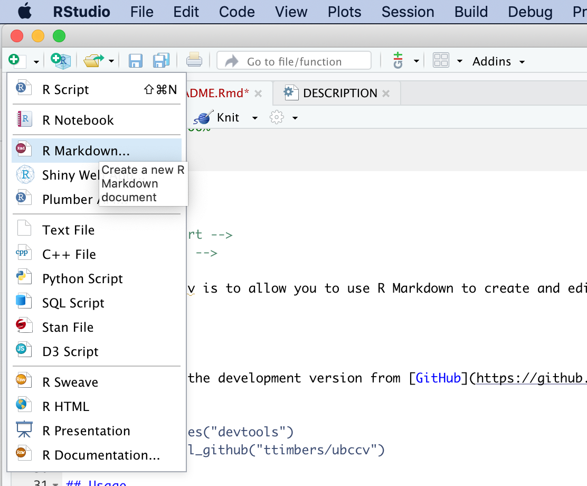
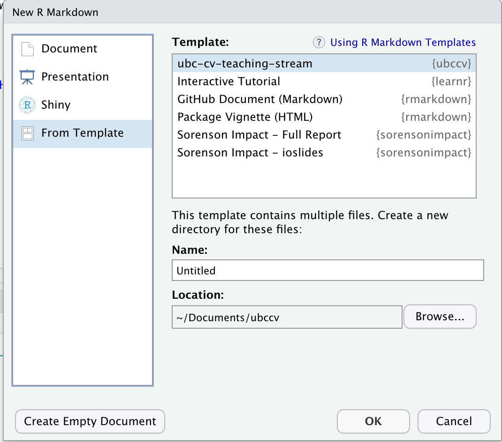

<!-- README.md is generated from README.Rmd. Please edit that file -->

```{r, include = FALSE}
knitr::opts_chunk$set(
  collapse = TRUE,
  comment = "#>",
  fig.path = "man/figures/README-",
  out.width = "100%"
)
```

# ubccv

<!-- badges: start -->
<!-- badges: end -->

The goal of ubccv is to allow you to use R Markdown to create and edit your UBC Faculty CV without having to touch a word document.

## Installation

You can install the development version from [GitHub](https://github.com/) with:

``` r
# install.packages("devtools")
devtools::install_github("ttimbers/ubccv")
```
## Usage

Inside RStudio, click on "Create a new R Markdown document:



Next, select "ubc-cv-teaching-stream" from the "From Template" menu:



## Code of Conduct
  
  Please note that the ubccv project is released with a [Contributor Code of Conduct](https://contributor-covenant.org/version/2/0/CODE_OF_CONDUCT.html). By contributing to this project, you agree to abide by its terms.
